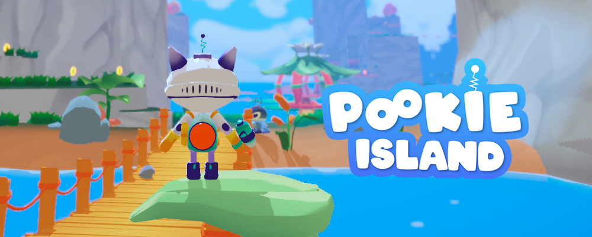
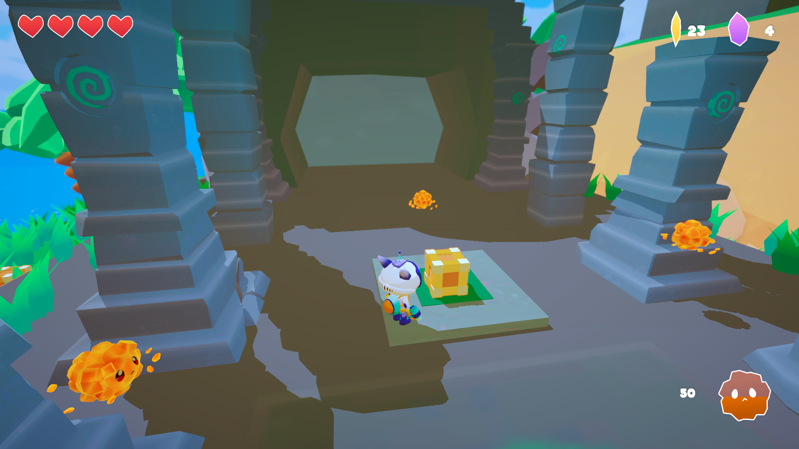
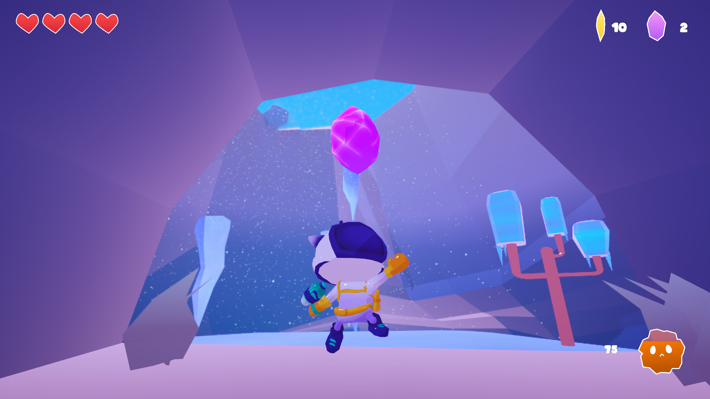
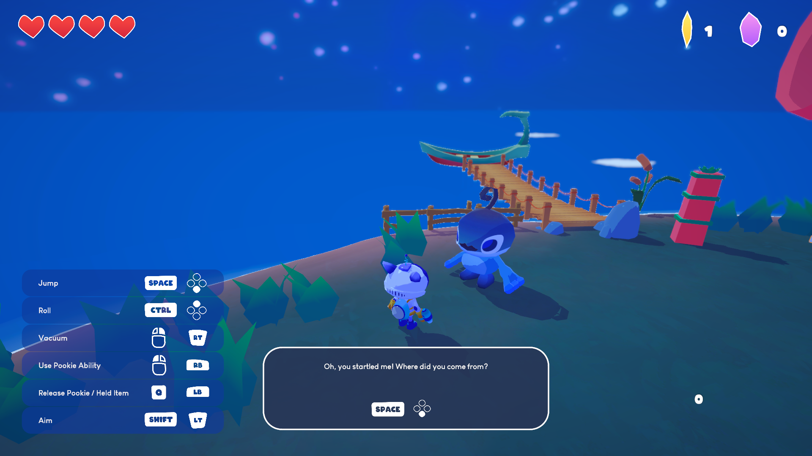
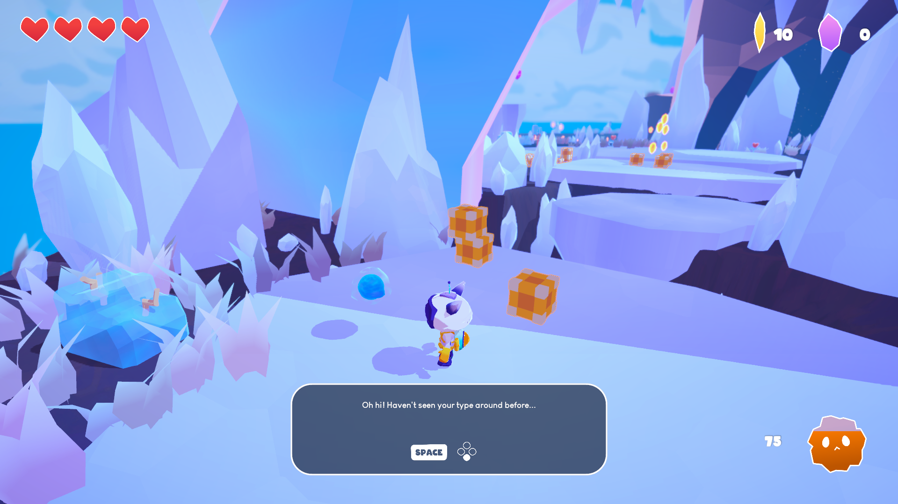

 

<h1>Pookie Island</h1>
<a href="https://nedrichard.itch.io/pookie-island">Itch.io link

</a>

 

## Description
In Pookie Island, you step into the moon boots of Space Kitty, whose adventure didn’t start quite as planned. You find yourself on a planet with islands inhabited by frogs and their elemental companions: Pookies, which will help you on your journey through these islands. Take on quests, solve puzzles & gather crystals to get back to your planet!

## Screenshots

  
  

  
  

## Features
  - 36 crystals to gather & 180 shards to collect
  - 3 types of pookies, with their own set of abilities
  - Multiple quests to accomplish
  - Environmental puzzles to solve
  - 3 thematic islands to explore

## Authors and acknowledgment
Programmers
  - Jere Joensuu
  - Otso Alenius

Artists
  - Elisa Pantea
  - Liisa Pirhonen
  - Karin Aimonen
  - Katariina Paulaniemi
  - Néd Richard

Music
  - Miiro Kesti

Pookie Island was created as a student project by Games Academy students from the Tampere University of Applied Sciences.
<a href="https://www.gamesacademy.fi/uncategorized/ga-spring-2022-pookie-island">More info on the blog.</a>
